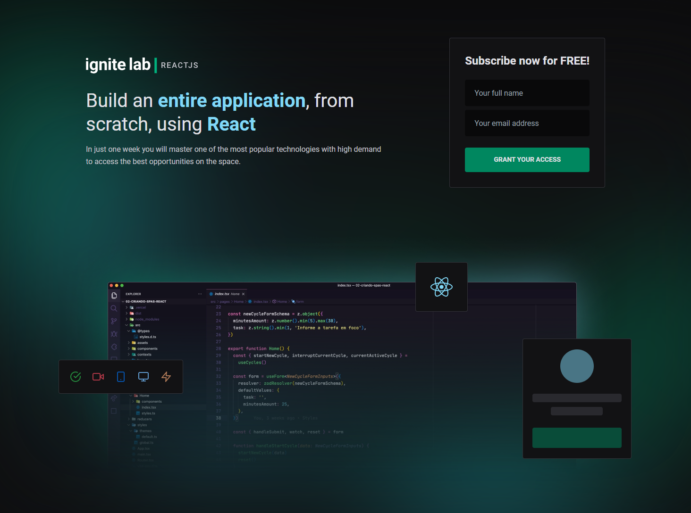
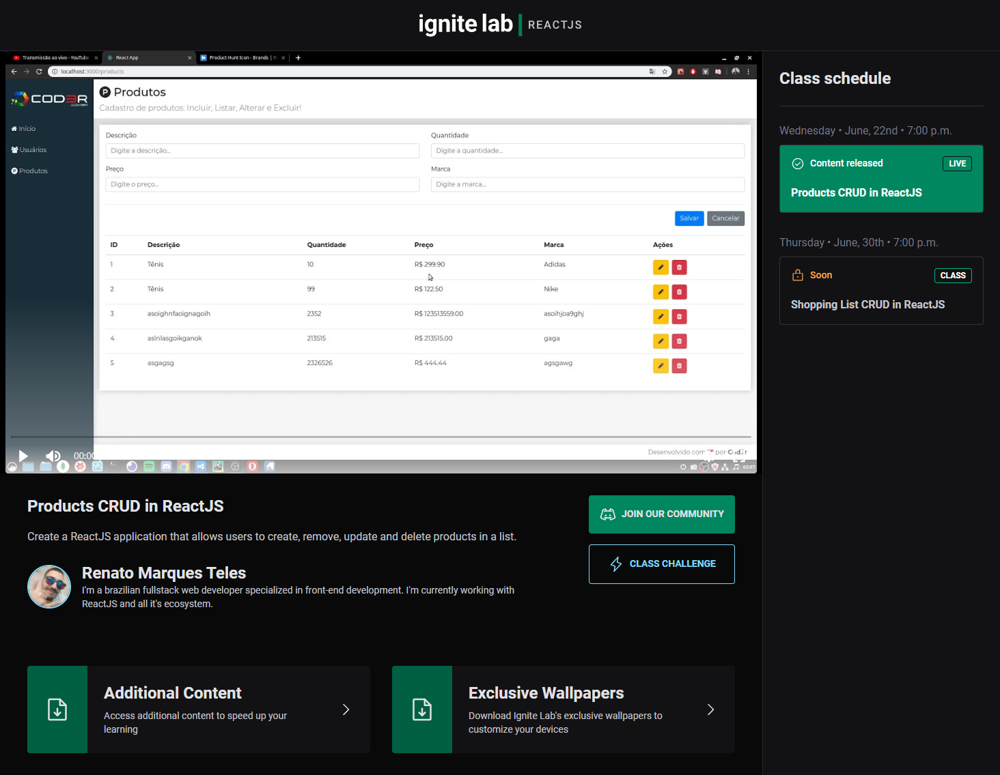

<h1 align="center">
  <br/>
  
  <br/><br/>
  <div>
    
    
    
    
    
  </div>
</h1>

## ✨ Description

This is a platform for users to watch online events via livestreams or pre-recorded videos. Developed during the "Ignite Lab - React JS" event hosted by [@Rocketseat](https://www.rocketseat.com.br).

## 🚀 Technologies
-  React
-  Typescript
-  Tailwind CSS
-  Headless CMS (Content Management System) with GraphCMS
-  @apollo/client and Graphql
-  svg2jsx to generate SVG components (https://svg2jsx.com/)
-  Phosphor icon family (https://phosphoricons.com/)

## 🔖 Layout

You can access the project's layout through [this link](https://www.figma.com/file/ScZyHztjsrG0LeD8XktgPz).

## 💻 Installation

After cloning/downloading this repository, open your terminal, navigate to the project's folder and run:

```cl
  npm install
  npm run dev
```

## 🌟 Preview



##
<br/>


